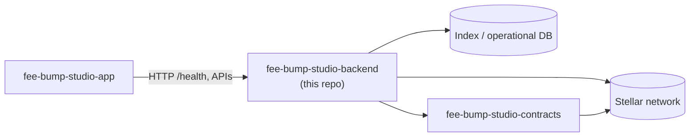

<div align="center">


# FeeBumpStudio Backend

*The service & indexing layer behind FeeBumpStudio* ⚙️

[](LICENSE)
[](https://github.com/FeeBumpStudio/fee-bump-studio-backend/actions/workflows/ci.yml)


</div>

---

## Why this exists

A developer workflow for **inspecting a transaction, estimating a replacement fee,
preparing fee-bump envelopes, and keeping the original transaction intent visible
for review**.

The backend exists to handle work that should not happen in a browser: indexing,
normalization, scheduled checks, API aggregation, persistence, reconciliation, and
operational diagnostics. **It does not custody user signing keys.**

### Where this repo fits

| Repo | Role |
| --- | --- |
| [`fee-bump-studio-app`](https://github.com/FeeBumpStudio/fee-bump-studio-app) | Web application, integration client, user workflow |
| [`fee-bump-studio-contracts`](https://github.com/FeeBumpStudio/fee-bump-studio-contracts) | Soroban/Rust protocol layer and contract tests |
| **`fee-bump-studio-backend`** (this repo) | Indexing, analysis, APIs, jobs, operational services |

## Features

- **API:** exposes read models and controlled application operations
- **Indexer/jobs:** consumes Stellar data and converts it into application-friendly records
- **Storage:** keeps operational data off-chain while retaining references to verifiable
  Stellar events
- **Observability:** records failures and processing latency without storing secrets
- **Idempotency by design:** reprocessing the same Stellar event converges to the same
  state; a network timeout must never silently create a duplicate business record
- Built-in `GET /health` endpoint for readiness checks

> ⚠️ **Status:** this is a development baseline. It is **not audited** and **not
> production-ready**. Do not use it with mainnet funds or production credentials.

## Architecture



## Tech stack

| Layer | Technology |
| --- | --- |
| Runtime | Node.js (built-in `http`, zero framework bloat) |
| Chain interaction | [@stellar/stellar-sdk](https://github.com/stellar/js-stellar-sdk) 17.2.1 |
| Tests | [`node:test`](https://nodejs.org/api/test.html) runner |
| Network | Stellar Testnet (development default) |

## Project structure

```text
fee-bump-studio-backend/
├── src/            # server.js — HTTP API server
├── assets/         # Banner and logo
├── docs/           # OPERATIONS runbook notes
├── .env.example    # Environment variable template
└── .github/        # CI workflow
```

## Prerequisites

- Node.js ≥ 18

## Installation

```bash
npm install
```

## Environment variables

```bash
cp .env.example .env
```

| Variable | Purpose |
| --- | --- |
| `STELLAR_NETWORK` | Which network the service targets (`testnet` by default) |
| `STELLAR_RPC_URL` | Soroban RPC endpoint URL (leave empty for the public Testnet default) |
| `STELLAR_CONTRACT_ID` | Deployed Soroban contract ID the service should index/interact with |
| `PORT` | Port the HTTP server listens on (defaults to `8080`) |

Keep RPC and database credentials strictly server-side; never expose them to the app.

## Running locally

```bash
npm run dev
# or
npm start
```

Then check:

```bash
curl http://localhost:8080/health
# {"ok":true}
```

## Testing

```bash
npm test        # runs the node:test suite
```

## Building / deploying

There is no build step — plain Node. For production:

- Add rate limits, structured logging, backups, alerting, and secret rotation
- See [docs/OPERATIONS.md](docs/OPERATIONS.md) for the required operational controls

## Roadmap

- [ ] Implement project-specific data model
- [ ] Add Stellar ingestion
- [ ] Add retry and idempotency handling
- [ ] Add database migrations
- [ ] Add integration tests
- [ ] Add metrics and structured logs
- [ ] Add production runbook

## Contributing

Contributions are welcome! Please read [CONTRIBUTING.md](CONTRIBUTING.md) before
opening a PR.

## Security

Please report vulnerabilities privately instead of filing public issues — see
[SECURITY.md](SECURITY.md).

## Code of Conduct

Be kind and respectful. This project follows contributor norms of good conduct as
described in [CONTRIBUTING.md](CONTRIBUTING.md); a dedicated Code of Conduct file is
coming as the community grows.

## Maintainer

**Jubilee** ([@Jubilee-001](https://github.com/Jubilee-001))

## License

Distributed under the [MIT License](LICENSE).
