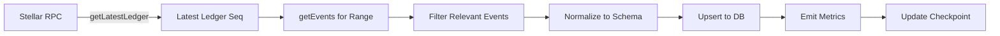
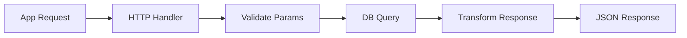

# Data Flow

## Ingestion Pipeline



### Ledger Processing

```typescript
// Simplified ingestion loop
async function processLedgers() {
  const server = new rpc.Server(RPC_URL);
  
  while (running) {
    const latest = await server.getLatestLedger();
    const from = lastProcessed + 1;
    const to = latest.sequence;
    
    if (from <= to) {
      const events = await server.getEvents({
        startLedger: from,
        endLedger: to,
        filters: [/* contract IDs, event types */],
      });
      
      for (const event of events) {
        await processEvent(event);
      }
      
      lastProcessed = to;
      await saveCheckpoint(to);
    }
    
    await sleep(POLL_INTERVAL_MS);
  }
}
```

### Event Filtering

| Filter Type | Example |
|-------------|---------|
| **Contract ID** | `CABC...CONTRACT` |
| **Event Type** | `contract`, `diagnostic` |
| **Topic** | `fee_bump_recorded`, `initialized` |
| **Account** | `GABC...ACTOR` |

### Normalization

Raw Stellar events → Application schema:

```typescript
interface NormalizedEvent {
  id: string;              // Unique: ledger-seq-event-idx
  ledger: number;          // Ledger sequence
  timestamp: Date;         // Ledger close time
  type: 'contract' | 'diagnostic';
  contractId: string;      // Contract address
  topics: string[];        // Event topics
  data: unknown;           // Decoded event data
  transactionHash: string; // Parent transaction
}
```

### Idempotency

Same event processed multiple times → same database state:

```sql
-- Upsert pattern
INSERT INTO events (id, ledger, timestamp, type, contract_id, topics, data, tx_hash)
VALUES ($1, $2, $3, $4, $5, $6, $7, $8)
ON CONFLICT (id) DO UPDATE SET
  ledger = EXCLUDED.ledger,
  timestamp = EXCLUDED.timestamp,
  type = EXCLUDED.type,
  contract_id = EXCLUDED.contract_id,
  topics = EXCLUDED.topics,
  data = EXCLUDED.data,
  tx_hash = EXCLUDED.tx_hash;
```

### Reorganization Handling

Stellar has probabilistic finality. Handle reorgs:

1. **Checkpoint** — Track last confirmed ledger
2. **Reorg Detection** — Compare checkpoints on startup
3. **Rollback** — Delete events from orphaned ledgers
4. **Reprocess** — Re-ingest from last confirmed ledger

```typescript
async function handleReorg() {
  const server = new rpc.Server(RPC_URL);
  const latest = await server.getLatestLedger();
  
  if (latest.sequence < lastCheckpoint) {
    // Reorg detected - rollback
    await db.delete('events', { ledger: { gt: latest.sequence } });
    lastProcessed = latest.sequence;
  }
}
```

## API Query Flow



### Query Patterns

| Pattern | Example |
|---------|---------|
| **Pagination** | `?page=1&limit=50` |
| **Filtering** | `?contract=CABC...&type=contract` |
| **Time Range** | `?from=2024-01-01&to=2024-01-31` |
| **Sorting** | `?sort=-ledger` |

### Response Format

```typescript
interface PaginatedResponse<T> {
  data: T[];
  pagination: {
    page: number;
    limit: number;
    total: number;
    pages: number;
  };
}
```

## Metrics Emission

Emit metrics for observability:

```typescript
const metrics = {
  ledgersProcessed: new Counter('ledgers_processed_total'),
  eventsIngested: new Counter('events_ingested_total', { type: 'contract|diagnostic' }),
  ingestionLatency: new Histogram('ingestion_latency_seconds'),
  reorgsDetected: new Counter('reorgs_detected_total'),
  dbErrors: new Counter('db_errors_total', { operation: 'upsert|query' }),
};
```

## Related Documentation

- [Architecture Overview](overview.md)
- [Components](components.md)
- [Operations - Monitoring](../operations/monitoring.md)