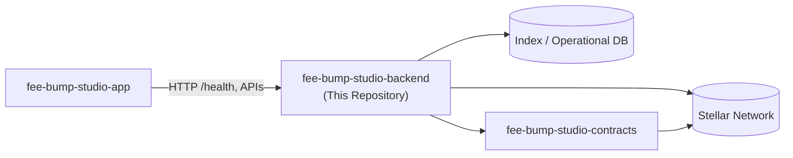

# FeeBumpStudio Backend

**The service & indexing layer behind FeeBumpStudio**

---

## Overview

FeeBumpStudio Backend handles work that should not happen in a browser:

- **Indexing** — Consumes Stellar data and converts it into application-friendly records
- **API** — Exposes read models and controlled application operations
- **Storage** — Keeps operational data off-chain while retaining references to verifiable Stellar events
- **Observability** — Records failures and processing latency without storing secrets
- **Idempotency by design** — Reprocessing the same Stellar event converges to the same state

The backend **does not custody user signing keys**.

---

## Project Status

> ⚠️ **Development Baseline** — This is **not audited** and **not production-ready**. Do not use with mainnet funds or production credentials.

---

## Quick Links

| Resource | Link |
|----------|------|
| **GitHub Repository** | [FeeBumpStudio/fee-bump-studio-backend](https://github.com/FeeBumpStudio/fee-bump-studio-backend) |
| **Issue Tracker** | [GitHub Issues](https://github.com/FeeBumpStudio/fee-bump-studio-backend/issues) |
| **Security Policy** | [SECURITY.md](https://github.com/FeeBumpStudio/fee-bump-studio-backend/blob/main/SECURITY.md) |
| **Contributing Guide** | [CONTRIBUTING.md](https://github.com/FeeBumpStudio/fee-bump-studio-backend/blob/main/CONTRIBUTING.md) |
| **App Documentation** | [fee-bump-studio-app docs](https://feebumpstudio.github.io/fee-bump-studio-app/) |
| **Contracts Documentation** | [fee-bump-studio-contracts docs](https://feebumpstudio.github.io/fee-bump-studio-contracts/) |

---

## Architecture Overview



---

## Technology Stack

| Layer | Technology |
|-------|------------|
| **Runtime** | Node.js (built-in `http`, zero framework bloat) |
| **Chain Interaction** | [@stellar/stellar-sdk](https://github.com/stellar/js-stellar-sdk) 17.2.1 |
| **Tests** | [`node:test`](https://nodejs.org/api/test.html) runner |
| **Network** | Stellar Testnet (development default) |

---

## Getting Started

### Prerequisites

- **Node.js** ≥ 18

### Installation

```bash
git clone https://github.com/FeeBumpStudio/fee-bump-studio-backend.git
cd fee-bump-studio-backend
npm install
```

### Configuration

```bash
cp .env.example .env
# Edit .env with your values
```

Required environment variables:

| Variable | Description | Default |
|----------|-------------|---------|
| `STELLAR_NETWORK` | Target network | `testnet` |
| `STELLAR_RPC_URL` | Soroban RPC endpoint | (public Testnet default) |
| `STELLAR_CONTRACT_ID` | Deployed contract ID | (required for indexing) |
| `PORT` | HTTP server port | `8080` |

### Running Locally

```bash
npm run dev
# or
npm start
```

Then check:

```bash
curl http://localhost:8080/health
# {"ok":true}
```

---

## Where This Repo Fits

| Repository | Role |
|------------|------|
| [`fee-bump-studio-app`](https://github.com/FeeBumpStudio/fee-bump-studio-app) | Web application, integration client, user workflow |
| [`fee-bump-studio-contracts`](https://github.com/FeeBumpStudio/fee-bump-studio-contracts) | Soroban/Rust protocol layer and contract tests |
| **`fee-bump-studio-backend`** | Indexing, analysis, APIs, jobs, operational services |

---

## Core Features

| Feature | Status | Description |
|---------|--------|-------------|
| **Health Endpoint** | ✅ Implemented | `GET /health` returns `{"ok":true}` |
| **Stellar Ingestion** | 🚧 Planned | Consume ledger data via RPC |
| **Contract Indexing** | 🚧 Planned | Index contract events and state |
| **API Endpoints** | 🚧 Planned | RESTful API for app consumption |
| **Idempotency** | 🚧 Planned | Deduplication via event IDs |
| **Observability** | 🚧 Planned | Structured logs, metrics, alerting |

---

## Maintainer

**Jubilee** ([@Jubilee-001](https://github.com/Jubilee-001))

---

## License

Distributed under the [MIT License](https://github.com/FeeBumpStudio/fee-bump-studio-backend/blob/main/LICENSE).